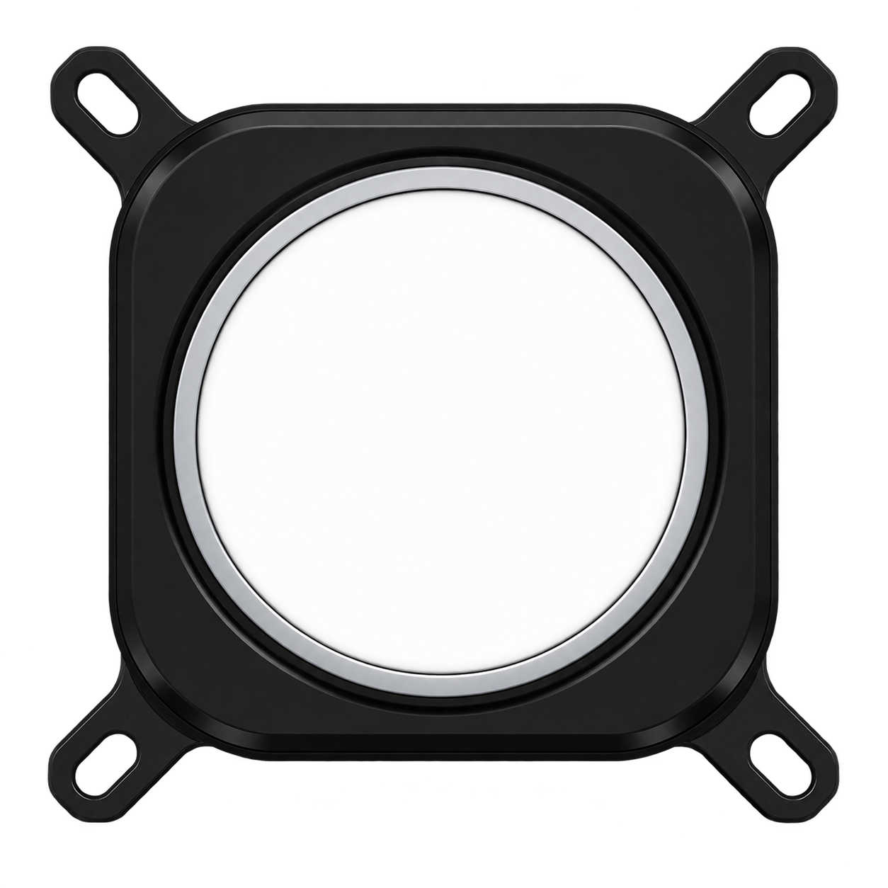

# Corsair Elite Display

<p align="center">
  
</p>

**Turn a Corsair LCD into a real 480×480 second Windows display.** Corsair Elite Display is a small native Rust tray app that creates a dedicated Windows monitor and streams it directly to the cooler LCD at up to 30 FPS.

No Electron, WebView, .NET, Python, or bundled application runtime is required.

## Features

- **Real Windows display** — move normal windows, video, dashboards, or games onto the cooler instead of preparing individual frames
- **Up to 30 FPS** — matches the LCD panel's native refresh rate
- **Low-latency capture** — latest-frame-only pipeline with no stale-frame queue
- **Reliable hardware hand-off** — OFF waits for the streaming worker and HID handle to shut down before returning the LCD to its persisted hardware screen
- **Hardware image control** — set the cooler's persistent hardware image from the tray while the virtual display is Off
- **Optional mouse overlay** — show or hide the cursor on the LCD
- **View presets** — native, 4:3, 16:10, and 16:9 center-zoom modes
- **Tray-only UI** — on/off, FPS, JPEG quality, brightness, rotation, view mode, startup, hardware image, and driver removal
- **Automatic reconnect** — reconnects when the LCD is unplugged or temporarily unavailable
- **Runtime-only virtual monitor** — the Windows display is attached only while the app is running and switched On

## Quick Start

1. Download `corsair-elite-display.exe` from the [latest release](../../releases/latest).
2. Run it. On first launch, Windows may show a UAC prompt so the bundled virtual-display driver can be installed and configured.
3. Close Corsair iCUE if it is currently holding exclusive access to the LCD.
4. Switch **On** from the tray icon and move a window onto the new 480×480 display.
5. Switch **Off** to remove the Windows display and return the cooler to its saved hardware screen.

The app has no main window. Right-click its notification-area icon for all settings.

> [!NOTE]
> Administrator access is used only when installing, repairing, or uninstalling the virtual-display driver. Normal capture and LCD streaming run without elevation.

## Hardware Image

While the virtual screen is **Off**, choose **Set hardware image/GIF...** from the tray menu. The image is written to the cooler's persistent hardware storage, so it remains available independently of desktop streaming.

The current hardware-image writer uses Corsair's locally installed iCUE 5 `cc021` device component and is intended for the `1B1C:0C39` Commander Core / Elite LCD path. Corsair Elite Display does **not** bundle Corsair DLLs. iCUE should be closed while this app owns the LCD.

There is no application-side `hardware-media.cache`: when streaming stops, the app releases the stream and performs the device hardware-mode hand-off so the cooler displays its own persisted hardware screen.

## Supported LCD Interfaces

The native streaming transport recognizes these Corsair USB IDs:

| USB ID | Device family |
|---|---|
| `1B1C:0C39` | Commander Core / Elite LCD Cap |
| `1B1C:0C33` | Elite LCD XT / Upgrade Kit |
| `1B1C:0C42` | Nautilus / Capellix XT LCD |
| `1B1C:0C4E` | iCUE LINK / TITAN LCD module |
| `1B1C:0C37` | H100i/H150i/H170i ELITE LCD family |
| `1B1C:0C40` | iCUE LINK System Hub LCD |
| `1B1C:0C53` | iCUE LINK XD5 LCD / reservoir |
| `1B1C:0C5B` | Corsair LCD module |

`1B1C:0C39` is the primary development and hardware-image target. Other recognized interfaces may vary by firmware/device generation; reports and contributions are welcome.

## Lowest-Latency Setup

- Use the 480×480 virtual display without additional Windows scaling.
- Select **30 FPS** and **75% · Balanced** quality.
- Keep the target content near 480×480 when possible.
- Avoid running another application that continuously writes to the same LCD.

The LCD refreshes at 30 Hz, so higher capture rates would only increase CPU and USB traffic.

## Driver and System Changes

Corsair Elite Display embeds the MIT-licensed **Virtual Display Driver (MttVDD)** files needed to create `Root\MttVDD`. On first setup the elevated helper can:

- install/bind the virtual-display package using Windows PnP/Setup APIs;
- create `C:\VirtualDisplayDriver\user_edid.bin` and `vdd_settings.xml` for the 480×480 display;
- recreate the root device node if an older uninstall removed it.

The tray menu also provides **Uninstall virtual display driver...**. Uninstalling removes the installed driver package and Corsair Elite Display's configuration directory.

Application settings are stored in:

```text
%APPDATA%\CorsairEliteDisplay\settings.ini
```

Enabling **Start with Windows** adds the current executable to the standard per-user Windows startup registry entry.

## Building from Source

Requirements:

- Windows 10/11 x64
- stable Rust toolchain with Rust 2024 edition support
- current Windows SDK / MSVC build tools

Build and test:

```powershell
cargo test --locked
cargo build --release --locked
```

The executable is created at:

```text
target\release\corsair-elite-display.exe
```

## How It Works

```text
Windows virtual display (480×480)
        ↓
GDI capture + optional cursor/view transform
        ↓
JPEG encoder
        ↓
Corsair 1024-byte HID image packets
        ↓
Cooler LCD

OFF / exit:
stream worker stops and HID handle closes
        ↓
known hardware-mode feature-report hand-off
        ↓
LCD resumes its persisted hardware screen
```

## Known Limitations

- Windows 10/11 x64 only.
- Competing software such as iCUE can hold exclusive access to the LCD; close it if the device cannot be opened.
- The app controls LCD presentation, brightness, and rotation. It does not control pump speed, fan curves, or RGB lighting.
- Persistent hardware-image writing currently targets the iCUE `cc021` / `0C39` path; streaming support is broader.
- Animated GIF input is handled by the current hardware-image writer according to the supported Corsair path and may differ across firmware revisions.

## Acknowledgments

- [OpenLinkHub](https://github.com/jurkovic-nikola/OpenLinkHub) and the wider open-source Corsair hardware community for independently documented LCD protocol behavior.
- [Virtual Display Driver](https://github.com/VirtualDrivers/Virtual-Display-Driver) for the bundled MttVDD virtual-display components.

Corsair, iCUE, and related product names are trademarks of their respective owner. This project is independent and is not affiliated with or endorsed by Corsair.

## License

Corsair Elite Display source code is released under the **MIT License**. Bundled third-party components retain their own copyright notices; see [THIRD_PARTY_NOTICES.md](THIRD_PARTY_NOTICES.md).
